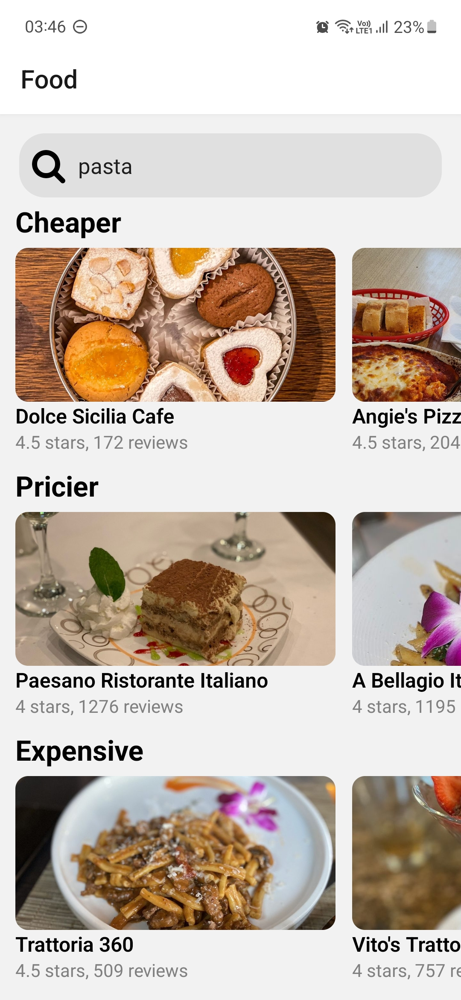
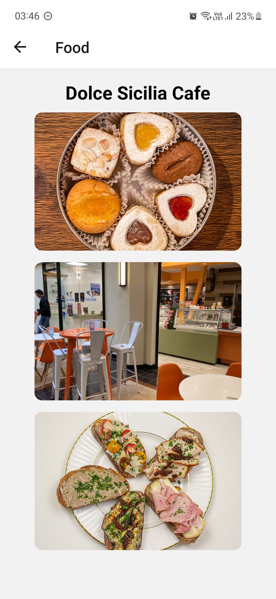
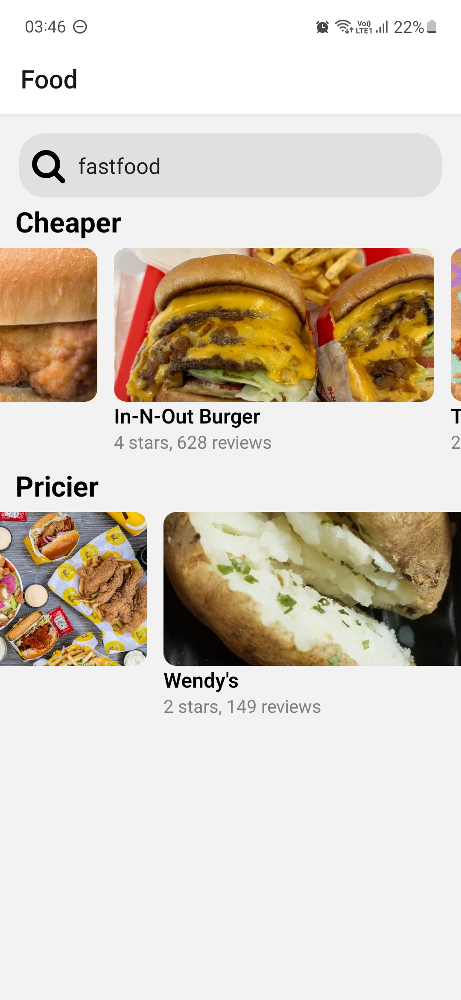
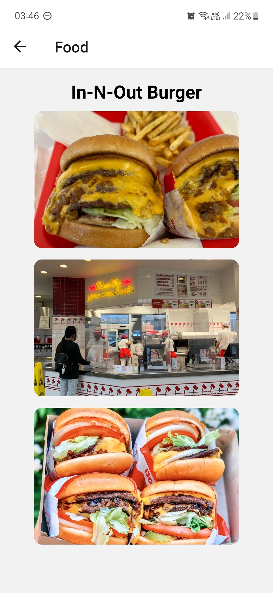

# 🍽 Yelp Restaurant Finder App 

- [Features](#features)
- [Prerequisites](#prerequisites)
- [Installation](#installation)
- [Usage](#usage)
- [Acknowledgments](#acknowledgments)
- [Screenshots](#screenshots)


Welcome to the Yelp Restaurant Finder App! This app is a learning project created to explore React Native development while using the Yelp API to display restaurant information, including their star ratings, review counts and images. The app categorizes restaurants by price, making it a useful tool for honing React Native skills.

## Features

- **Restaurant Listings**: Browse a curated list of restaurants, categorized by their price range.
- **Search Functionality**: Search for specific restaurants or cuisines to find exactly what you're craving.
- **Review Counts and Rating**: See the count of reviews and rating of the restaurant.
- **Image Gallery**: View a gallery of images to get a visual sense of the restaurant's ambiance and dishes.

## Prerequisites

Before you start exploring the Yelp Restaurant Finder App (Learning Project), please make sure you have the following:

- **API Key**: To use this app, you'll need to obtain an API key from Yelp by registering your app on the Yelp Fusion API platform. This API key will allow your app to access Yelp's restaurant data. Ensure that you keep your API key secure and never share it publicly.

## Installation

1. Clone the repository to your local machine:

   ```bash
   git clone https://github.com/dybdeskarphet/learn-rn-food-app.git
   ```

2. Navigate to the project directory:

   ```bash
   cd learn-rn-food-app
   ```

3. Create a `.env` file in the root directory and add your Yelp API key:

   ```env
   YELP_API_KEY=your_api_key_here
   ```

4. Install the app's dependencies:

   ```bash
   npm install
   ```

5. Start the app:

   ```bash
   npm start
   ```

6. Launch the app through Expo by scanning the QR code.

## Usage


1. Browse through the different price categories to practice React Native development and explore restaurant data.

2. Click on a restaurant to view more images about the restaurant.

3. Use the search bar to experiment with search functionality.

## Acknowledgments

- This app was developed as a learning exercise in React Native, using the Yelp Fusion API for data retrieval.
- Special thanks to the Yelp API team for providing access to their restaurant data.

## Screenshots
 

 
